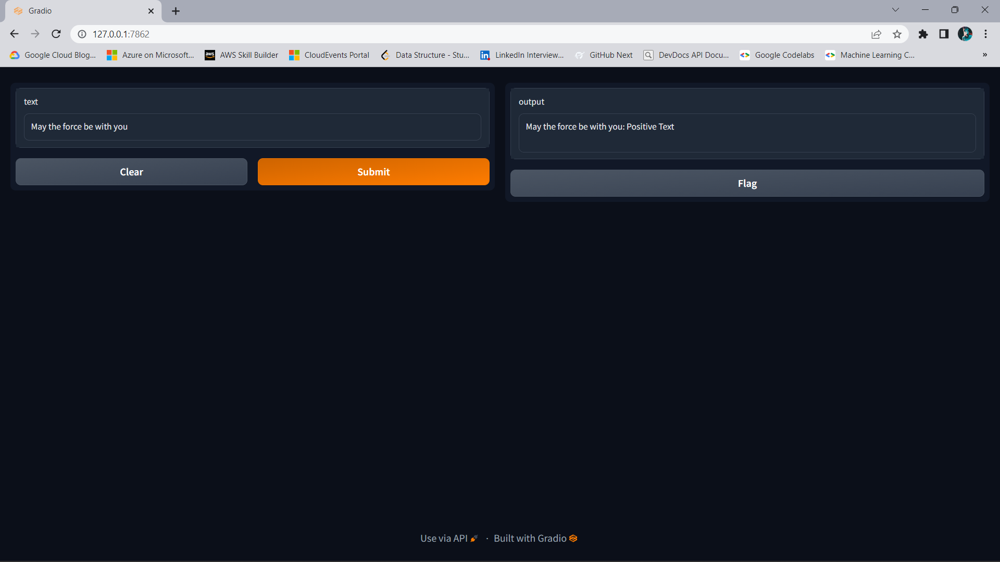
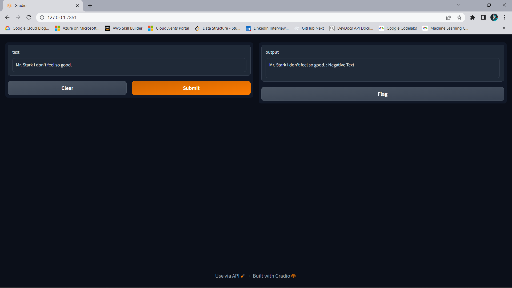

# Text Sentiment Analysis
This is a simple text sentiment analysis project. It uses the library to analyze the sentiment of a given text. The project is built with Python and the libraries used are numpy, matplotlib, pandas, seaborn, nltk, scikit-learn, and ipykernel. The model is built using Logistic Regression. The model is trained on the cleaned data and then tested on the test data. The model is then saved using the pickle library. The UI is created using Gradio.

## Requirements
- Python 3.9
- ipykernel
- numpy
- matplotlib
- pandas
- seaborn
- nltk
- scikit-learn

## Data Cleaning 
The data cleaning process is done in the notebook. The data is cleaned by removing the stopwords, punctuations, and other unnecessary characters. The data is then tokenized and lemmatized. The data is then converted into a vector using the TF-IDF vectorizer.

## Model Building
The model is built using Logistic Regression. The model is trained on the cleaned data and then tested on the test data. The model is then saved using the pickle library.

## You can run the project locally by following these steps:
- Clone the repository
- Create a virtual environment
- Install the requirements
- Run the notebook

## Screenshots
Example 1

Example 2

